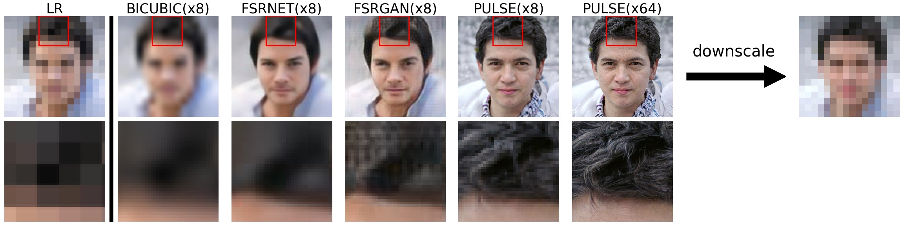
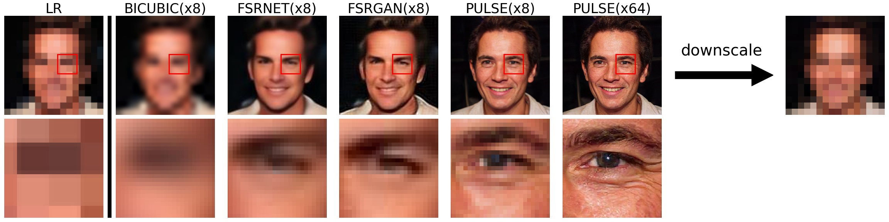
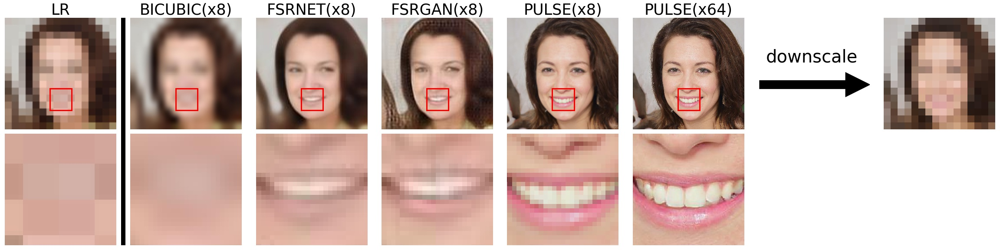

# PULSE MacOS: Self-Supervised Photo Upsampling via Latent Space Exploration of Generative Models

Code accompanying CVPR'20 paper of the same title. Paper link: https://arxiv.org/pdf/2003.03808.pdf

## MacOS
The project works on MacOS Ventura, MacbookPro 13 2018. Without CUDA.
## NOTE

We have noticed a lot of concern that PULSE will be used to identify individuals whose faces have been blurred out. We want to emphasize that this is impossible - **PULSE makes imaginary faces of people who do not exist, which should not be confused for real people.** It will **not** help identify or reconstruct the original image.

We also want to address concerns of bias in PULSE. **We have now included a new section in the [paper](https://arxiv.org/pdf/2003.03808.pdf) and an accompanying model card directly addressing this bias.**

---





Table of Contents
=================
- [PULSE: Self-Supervised Photo Upsampling via Latent Space Exploration of Generative Models](#pulse-self-supervised-photo-upsampling-via-latent-space-exploration-of-generative-models)
- [Table of Contents](#table-of-contents)
  - [What does it do?](#what-does-it-do)
  - [Usage](#usage)
    - [Prereqs](#prereqs)
    - [Data](#data)
    - [Applying PULSE](#applying-pulse)
## What does it do? 
Given a low-resolution input image, PULSE searches the outputs of a generative model (here, [StyleGAN](https://github.com/NVlabs/stylegan)) for high-resolution images that are perceptually realistic and downscale correctly.


## Usage

The main file of interest for applying PULSE is `run.py`. A full list of arguments with descriptions can be found in that file; here we describe those relevant to getting started.

### Prereqs

```
conda update conda
conda update anaconda
sudo apt-get update
sudo apt-get install cmake
sudo apt-get install -y build-essential
conda create -f pulse.yml 
conda activate pulse
```

### Data

By default, input data for `run.py` should be placed in `./input/` (though this can be modified). However, this assumes faces have already been aligned and downscaled. If you have data that is not already in this form, place it in `realpics` and run `align_face.py` which will automatically do this for you. (Again, all directories can be changed by command line arguments if more convenient.) You will at this stage pic a downscaling factor. 

Note that if your data begins at a low resolution already, downscaling it further will retain very little information. In this case, you may wish to bicubically upsample (usually, to 1024x1024) and allow `align_face.py` to downscale for you.  

### Applying PULSE
Once your data is appropriately formatted, all you need to do is
```
python run.py
```
Enjoy!

## Resources
1. [Source repository](https://github.com/krantirk/Self-Supervised-photo)
2. [Computing on the CPU](https://github.com/marcin-laskowski/Pulse)
